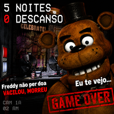

# FNAF-Project
# 🎮 5 Noites 0 Descanso

> Um jogo de terror inspirado em clássicos de sobrevivência noturna — só que com **zero descanso, muito desespero e uma boa dose de meme.**

## 🕹️ Sobre o jogo

**5 Noites 0 Descanso** é um jogo de terror desenvolvido na **Unreal Engine**, inspirado na fórmula de jogos de sobrevivência em uma pizzaria durante a madrugada.

Você é o responsável por sobreviver durante o turno da noite enquanto criaturas animatrônicas começam a se movimentar pelo estabelecimento.

Seu objetivo é simples:

**Sobreviver até às 6 da manhã.**

Só tem um pequeno problema...

**Eles não querem deixar você sobreviver. 💀**

---

## 👁️ Gameplay

Durante a noite, o jogador precisa:

* 📹 Monitorar as câmeras de segurança
* 🚪 Controlar as portas
* 💡 Utilizar as luzes para verificar os corredores
* ⚡ Administrar os recursos disponíveis
* 👀 Observar os movimentos dos animatrônicos
* 🧠 Descobrir padrões para conseguir sobreviver
* 🌙 Tentar chegar às **6:00 AM**

Cada erro pode resultar em...

> **GAME OVER.**

---

## 🛠️ Tecnologias

| Tecnologia          | Utilização                    |
| ------------------- | ----------------------------- |
| 🎮 Unreal Engine    | Engine principal              |
| 🧩 Blueprints       | Programação                   |
| 🎨 3D Assets        | Cenários e personagens        |
| 🔊 Áudio            | Ambientação e efeitos sonoros |
| 💡 Lumen / Lighting | Iluminação e atmosfera        |

---

## 📋 Características

* [x] Sistema de câmeras
* [x] Sistema de portas
* [x] Sistema de iluminação
* [x] Animatrônicos
* [x] Sistema de sobrevivência
* [x] Atmosfera de terror
* [x] Elementos de humor/meme
* [x] Sistema de Game Over
* [x] Progressão durante a noite

---

## 🎯 Objetivo

Sobreviva ao turno.

Não deixe os animatrônicos chegarem até você.

Economize seus recursos.

E, principalmente...

### **NÃO ENTRE EM PÂNICO.**

*(Você provavelmente vai entrar.)* 💀

---

## 📸 Screenshots

> Screenshots do jogo serão adicionados aqui em breve.

---

## 🎥 Gameplay

> Vídeo de gameplay será disponibilizado aqui futuramente.

---

## 🚀 Como executar o projeto

### Requisitos

* Windows 10/11
* Processador i5 1gen ou superior
* 8gb Ram
* GPU compatível com directX
* 2gb de espaço livre

---

## ⚠️ Aviso

Este projeto é uma criação independente e utiliza elementos inspirados no gênero de horror com animatrônicos.

**FNAF** e seus personagens oficiais pertencem aos seus respectivos detentores de direitos.

Este projeto não possui relação oficial com a franquia original.

---

## 👨‍💻 Desenvolvedor

Desenvolvido por **Peter**.

Projeto independente criado para estudo, desenvolvimento de jogos e, principalmente:

**fazer o jogador sofrer. 💀**

---

## ⭐ Apoie o projeto

Se você gostou do projeto, considere deixar uma ⭐ no repositório!

Isso ajuda bastante no desenvolvimento e mostra que alguém realmente conseguiu sobreviver às noites.

---

### 🌙 Boa sorte.

**6:00 AM parece perto...**

**mas não é.**
